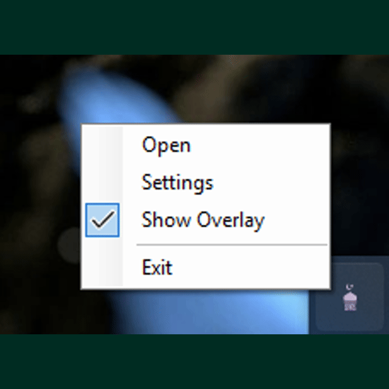

# Daily Prayer Timer (Native)

Version: 1.5.7

A premium, glassmorphic Windows desktop application for Islamic prayer time tracking with a sleek taskbar-docked overlay.

## 📸 App Preview

## 🚀 Key Features

- **Taskbar Overlay**: A minimal, non-intrusive widget that docks to your taskbar (DU Meter style).
- **Popup Expansion**: Hover over the overlay to see a smooth vertical "popup" growth with current and next prayer details.
- **Glassmorphism UI**: Modern, premium design with semi-transparent backgrounds and vibrant Islamic Green gradients.
- **Prohibited Time Alerts**: Automatic detection and visual warnings for sunrise, zawal, and sunset periods.
- **Smart Congregation Entry**: Time selectors in Settings are now strictly filtered to each prayer's valid range (e.g., you can't set Fajr Jamaat at 10 AM).
- **Adhan Sound Management**: Integrated downloader for default Adhan audio and built-in "Test Sound" for verification.
- **Premium Themes**: Full control over primary/secondary colors and background gradients with a native color picker.
- **Live Highlights Countdown**: Real-time countdowns for Suhur (Ends) and Iftar (Begins) with automatic "Passed" status tracking.
- **Smart Update System**: Automatic version checks on startup and a manual "Check for Updates" button in Settings.
- **Tray Persistence**: Runs in the background with a system tray icon for quick access and settings.

## 🛠️ Tech Stack

- **Framework**: WPF (.NET 8.0)
- **Styling**: Vanilla XAML with custom glassmorphism styles
- **Library**: `Adhan` for prayer time calculations
- **Notifications**: `Microsoft.Toolkit.Uwp.Notifications`

## ⚙️ Configuration

The app saves your preferences in `%APPDATA%\DailyPrayerTimeNative\settings.json`. You can configure:

- **Location**: Search by city name (using LocationIQ API).
- **Methods**: Karachi, UMM_AL_QURA, North America, etc.
- **Madhab**: Standard (Shafi) or Hanafi.
- **Theme**: Custom primary/secondary colors and background gradients.
- **Auto-Start**: Toggle to run on Windows startup.

## 📦 Installation
The application comes with a professional Windows Installer (`.exe`) that handles shortcuts and uninstallation.

1. Navigate to the `Output` folder.
2. Run the latest installer (e.g., **`DailyPrayerTimer_Setup_v1.5.7.exe`**).
3. Follow the installation wizard to create Desktop and Start Menu shortcuts.

Once installed, you can find **Daily Prayer Timer** on your Desktop or by searching in the Windows Start Menu.

## 🛠️ Building from Source

1. Clone the repository.
2. Open in Visual Studio 2022 or use CLI.
3. Run `dotnet publish -c Release -r win-x64 --self-contained`.

## 📜 Dev Info

Developed by **Abiruzzaman Molla**
[GitHub Profile](https://github.com/AbiruzzamanMolla)

---

© 2026 Abiruzzaman Molla. All Rights Reserved.
